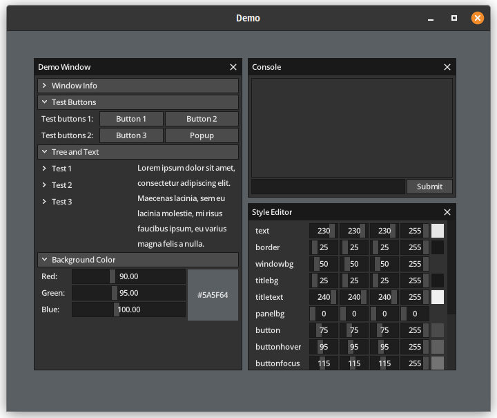

# ddui, Immediate Mode UI

ddui is a BetterC compatible Immediate Mode User Interface.

This is a D port of [rxi/microui](https://github.com/rxi/microui) after being
angry at my Imgui/Nuklear bindings not working. I'd like to personally thank rxi
for making microui and Mike Parker for bindbc-opengl and bindbc-sdl.

# Features

- BetterC compatibility.

# Roadmap

- Rename all prefixes.
- Embedded documentation.
- Improve string handling (maybe string_t).
- Replace FNV-1a hash by Murmurhash3-32.
- Textbox input navigation.
- Triangle corner hint and/or cursor change for resizable windows.
- Fix host window resizing for current example.
- Fix window dragging when on-top of each other for current example.
- Fix z-index global state (window management).
- Demo: Support OpenGL 3.3 and/or ES 2.0.
- (Research needed) Use bsearch for searching hashes.
- (Considering) Dedicated helper functions to aid SDL2/Allegro/GLFW integration.

# Example

There is currently only one example using SDL2 and OpenGL 1.1.

To build it:
1. Navigate to the `demo` directory.
2. Obviously, you'll need a fairly recent DUB and D compiler.
3. Install the SDL2 library (Ubuntu: `libsdl2` package, Windows: place `sdl2.dll` in directory). (Note: this uses the dynamic configuration)
4. Type `dub`.